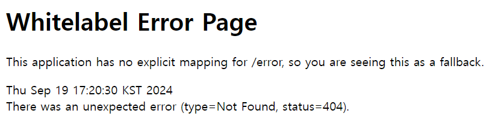

## 이번주 스터디를 통해 배운 내용
1. WEB
    - 웹은 여러 컴퓨터가 서로 연결되어 정보를 공유하는 공간으로, 웹에서 컴퓨터가 서로 정보를 주고 받는 일반적인 형태는 클라이언트-서버 패러다임
2. 클라이언트 - 서버
    - 클라이언트 : 데이터의 생성/조회/수정/삭제 요청을 전송
    - 서버 : 요청대로 동작을 수행하고 응답을 전송
3. HTTP
    - 웹에서 사용하는 프로토콜
    - HTTP Method로는 GET, POST, PUT, PATCH, DELETE 등이 있음
    - HTTP 헤더는 통신에 대한 정보, HTTP 바디는 주고 받으려는 데이터를 담고 있음
4. 프론트 - 백엔드
    - 프론트는 화면에 채울 컨텐츠 데이터를 백엔드에게 요청
    - 백엔드는 DB에서 가져온 컨텐츠 데이터를 프론트에게 응답
    - 보통 JSON 형태로 데이터를 주고 받음
5. API(Application Programming Interface)
    - HTTP는 웹에서 데이터를 주고받는 단순한 규칙이고, 구체적인 통신 방법은 규칙 안에서 직접 정의
    - 어플리케이션에서 원하는 기능을 수행하기 위해 어플리케이션과 소통하는 구체적인 방법을 정의한 것

## API 명세서
- 유저 관리 API
    - 회원 가입 : POST /join
    - 로그인 : POST /login
- 할 일 관리 API
    - 할 일 생성 : POST /todo
    - 할 일 목록 조회 : GET /todos
    - 할 일 수정 : PATCH /todo/{todo_id}
    - 할 일 삭제 : DELETE /todo/{todo_id}
    - 할 일 체크 및 해제 : POST /todo/{todo_id}/check
- 친구 API
    - 친구 추가(팔로우) : POST /friend/{user_id}
    - 친구 삭제(언팔로우) : DELETE /friend/{user_id}
    - 친구 목록 조회 : GET /friend/list
    - 특정 친구의 할 일 조회 : GET /friend/{user_id}/todos

## 어플리케이션 실행 사진
